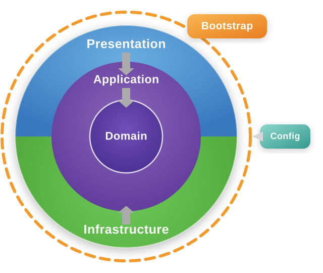

# Go Clean Architecture Template

This project is a REST API template built with Go and Clean Architecture. The structure keeps business rules independent from frameworks, databases, JWT providers, loggers, and other technical details. Dependencies point inward: outer layers may depend on inner layers, but inner layers must not depend on outer layers.

<p align="center">
  
</p>

## Tech Stack

- Go 1.25
- Gin as the HTTP framework
- PostgreSQL as the database
- SQLX and PGX for database access
- JWT for token authentication
- Bcrypt for password hashing
- Zerolog for logging
- Viper for `.env` configuration
- Docker Compose for running the app, PostgreSQL, and pgAdmin

## Template Features

- Health check endpoint.
- User registration and login.
- JWT authentication.
- API key authentication.
- Role based authorization.
- Device creation endpoint.
- Request DTO and response DTO.
- Centralized response format.
- Centralized error handling.
- Custom validation layer.
- Repository pattern.
- Unit of Work for database transactions.
- Manual dependency injection through the `bootstrap` package.
- Database migrations and seed data.
- OpenAPI specification in `api/api-spec.json`.

## Project Structure

```text
.
|-- api/                         # OpenAPI specification
|-- cmd/                         # Application entry points
|   |-- api/                     # Main API entry point
|   `-- worker/                  # Cobra command / HTTP command
|-- db/
|   |-- migration/               # Database migration files
|   `-- seed/                    # Initial seed data
|-- internal/
|   |-- application/             # Application business flow and DTOs
|   |-- bootstrap/               # Application dependency wiring
|   |-- config/                  # Configuration loader
|   |-- domain/                  # Enterprise business rules
|   |-- infrastructure/          # External technical implementations
|   `-- presentation/            # HTTP controllers, middleware, responses, validation
|-- Dockerfile
|-- docker-compose.yml
|-- Makefile
`-- README.md
```

## Clean Architecture Principles

Clean Architecture separates code by responsibility. The goal is to keep business rules stable even when technical details change.

Layer order in this project:

```text
Presentation -> Application -> Domain <- Infrastructure
```

Dependency direction:

- `presentation` receives HTTP requests and calls usecases.
- `application` executes application business flows using contracts from `domain`.
- `domain` contains entities, interfaces, errors, enums, policies, and core contracts.
- `infrastructure` implements contracts from `domain`, such as database repositories, JWT, bcrypt, UUID, and logger.
- `bootstrap` wires all dependencies without making core layers depend on technical details.

## Domain Layer

Location: `internal/domain`

Domain is the innermost layer. It contains core rules and must not depend on frameworks, databases, HTTP transport, or specific external libraries.

Main contents:

- `entity/`: core models such as `User`, `Role`, and `Device`.
- `repository/`: repository interfaces required by usecases.
- `usecase/`: usecase interfaces consumed by presentation.
- `security/`: security contracts such as `PasswordHasher`, `TokenService`, and `TokenClaims`.
- `service/`: domain service contracts such as `UUIDGenerator`.
- `error/`: business errors such as email already exists, invalid role, invalid credential.
- `enum/`: domain constants such as `ADMIN` and `CUSTOMER`.
- `policy/`: authorization or domain policy rules.
- `logger/`: logger contract so domain/application are not tied to Zerolog.

Example entity:

```go
type User struct {
	ID        int64
	UUID      string
	Name      string
	Email     string
	Password  string
	RoleID    int64
	CreatedAt time.Time
	UpdatedAt time.Time
}
```

Example repository contract:

```go
type UserRepository interface {
	Create(ctx context.Context, user *entity.User) error
	FindByUUID(ctx context.Context, uuid string) (*entity.User, error)
	FindByEmail(ctx context.Context, email string) (*entity.User, error)
	Update(ctx context.Context, user *entity.User) error
	DeleteByUUID(ctx context.Context, uuid string) error
}
```

Clean code rules for domain:

- Do not import `gin`, `sqlx`, `jwt`, `bcrypt`, or infrastructure packages.
- Use clear names for business concepts.
- Use interfaces for dependencies that come from outside the domain.
- Define business errors explicitly so they can be mapped to HTTP responses.
- Entities should not know about JSON request or response shapes.

## Application Layer

Location: `internal/application`

The application layer coordinates usecase flows. It answers the question: "What must the application do to complete this business process?"

Main contents:

- `usecase/`: business flow implementations such as register, login, and create device.
- `dto/request/`: request DTOs for usecase input.
- `dto/response/`: response DTOs for usecase output.

Example `Register` flow:

1. Receive `RegisterUserRequest`.
2. Convert role name to role ID.
3. Check whether the email is already used.
4. Hash the password.
5. Generate a UUID.
6. Create a `User` entity.
7. Save the user through the repository inside a transaction.
8. Return `RegisterResponse`.

The application layer may:

- Use entities and contracts from domain.
- Use request DTOs and response DTOs.
- Orchestrate repositories and services.
- Open transactions through `UnitOfWork`.
- Convert entities into response DTOs.

The application layer must not:

- Read or write HTTP responses.
- Access the database directly.
- Know Gin, SQLX, PostgreSQL, JWT implementation, or bcrypt implementation details.
- Store HTTP-specific validation logic such as JSON body parsing.

## Request DTO

Location: `internal/application/dto/request`

Request DTOs are input objects passed into usecases. They separate API input shape from domain entities.

Available DTOs:

```go
type RegisterUserRequest struct {
	Name            string `json:"name"`
	Password        string `json:"password"`
	ConfirmPassword string `json:"confirm_password"`
	Email           string `json:"email"`
	Role            string `json:"role"`
}

type LoginUserRequest struct {
	Email    string `json:"email"`
	Password string `json:"password"`
}

type CreateDeviceRequest struct {
	Name string `json:"name"`
}
```

Why request DTOs are separated from entities:

- Request fields are not always the same as entity fields.
- Requests may contain extra fields such as `confirm_password`.
- Entities do not need to depend on JSON tags.
- Usecases are easier to test because their input is explicit.
- API contract changes do not directly break domain models.

## Response DTO

Location: `internal/application/dto/response`

Response DTOs are output objects returned by usecases. They define which data may leave the application layer.

Available DTOs:

```go
type UserResponse struct {
	UUID  string
	Name  string
	Email string
	Role  string
}

type RegisterResponse struct {
	User UserResponse
}

type LoginResponse struct {
	User  UserResponse
	Token string
}

type DeviceResponse struct {
	ID   int64
	Name string
}
```

Important notes:

- Password is never returned through response DTOs.
- Response DTOs only carry data needed by the client.
- Mapping from entity to response DTO happens in the application layer.
- The presentation layer only wraps DTOs into HTTP response format.

## Presentation Layer

Location: `internal/presentation`

The presentation layer is the outer layer for HTTP communication. This project uses Gin for the presentation layer.

Main contents:

- `controller/`: HTTP handlers such as `UserController` and `DeviceController`.
- `middleware/`: auth, role, logger, timeout, and error handler middleware.
- `response/`: JSON response helpers and error mapper.
- `validation/`: request validation rules.

Controller responsibilities:

1. Bind JSON body into request DTO.
2. Run input validation.
3. Call the usecase.
4. Map errors into response errors.
5. Send JSON response.

Example controller flow:

```go
req := new(request.LoginUserRequest)

if err := ctx.ShouldBindJSON(req); err != nil {
	ctx.Error(err)
	return
}

if err := validation.Validate(validation.LoginUserRules(req)); err != nil {
	ctx.Error(err)
	return
}

res, err := c.userUseCase.Login(ctx.Request.Context(), req)
if err != nil {
	ctx.Error(response.MapError(err))
	return
}

response.ResponseOK(ctx, res)
```

Clean code rules for presentation:

- Keep controllers thin.
- Do not put business rules in controllers.
- Do not query the database directly from controllers.
- Keep HTTP input validation in presentation.
- Map domain errors through `response.MapError`.
- Keep response format consistent through response helpers.

## API Response Format

Location: `internal/presentation/response/dto/web_response.go`

All JSON responses are wrapped with this format:

```go
type WebResponse[T any] struct {
	Message string        `json:"message,omitempty"`
	Data    T             `json:"data"`
	Paging  *PageMetaData `json:"paging,omitempty"`
	Errors  []FieldError  `json:"errors,omitempty"`
}
```

Success response example:

```json
{
  "message": "success",
  "data": {
    "User": {
      "UUID": "550e8400-e29b-41d4-a716-446655440000",
      "Name": "John Doe",
      "Email": "user@example.com",
      "Role": "CUSTOMER"
    },
    "Token": "jwt-token"
  }
}
```

Validation error response example:

```json
{
  "message": "input validation error",
  "errors": [
    {
      "field": "email",
      "message": "email must be a valid email"
    }
  ]
}
```

## Infrastructure Layer

Location: `internal/infrastructure`

Infrastructure contains technical implementations for contracts defined in domain.

Main contents:

- `persistence/database/`: database connection and unit of work.
- `persistence/repository/`: PostgreSQL repository implementations.
- `persistence/dbtx/`: query executor abstraction so repositories can use either DB or transaction.
- `security/jwt/`: JWT token service implementation.
- `security/bcrypt/`: password hasher implementation.
- `identity/`: UUID generator implementation.
- `logging/`: logger implementation with Zerolog.
- `encoding/base64/`: encoding helper.

Dependency principle example:

- Domain defines `UserRepository`.
- Infrastructure creates `userRepository` that implements `UserRepository`.
- Application only receives the `UserRepository` interface, not the concrete infrastructure struct.

With this pattern, the database can be replaced without changing business logic. For example, changing from PostgreSQL to MySQL should mostly affect `internal/infrastructure/persistence/repository`.

## Bootstrap Layer

Location: `internal/bootstrap`

Bootstrap wires application dependencies. This package is the composition root.

Bootstrap responsibilities:

1. Load configuration.
2. Create logger.
3. Create database connection.
4. Create unit of work.
5. Create JWT service.
6. Create bcrypt hasher.
7. Create UUID generator.
8. Create usecases.
9. Create controllers.
10. Create HTTP server and routes.

Dependency wiring example:

```go
uow := database.NewUnitOfWork(db)
jwtUtil := NewTokenService(cfg)
passwordHasher := bcryptinfra.NewBcryptEncryptor(cfg.App.BCryptCost)
uuidGenerator := identity.NewUUIDGenerator()

useCase := NewUseCase(uow, passwordHasher, jwtUtil, uuidGenerator)
controller := NewController(useCase)
httpServer := NewHTTPServer(cfg, log, jwtUtil, controller)
```

## Config Layer

Location: `internal/config`

Config reads `.env` using Viper and maps configuration into these structs:

- `AppConfig`
- `HttpServerConfig`
- `DatabaseConfig`
- `JwtConfig`
- `LoggerConfig`

Required variables example:

```env
APP_ENVIRONMENT=debug
APP_BCRYPT_COST=10

HTTP_SERVER_HOST=0.0.0.0
HTTP_SERVER_PORT=8000
HTTP_SERVER_GRACE_PERIOD=10
HTTP_SERVER_REQUEST_TIMEOUT_PERIOD=10
HTTP_SERVER_API_KEY=your-api-key

DB_HOST=localhost
DB_PORT=5432
DB_NAME=postgres
DB_USER=postgres
DB_PASSWORD=postgres
DB_SSL_MODE=disable
DB_MAX_IDLE_CONN=10
DB_MAX_OPEN_CONN=100
DB_CONN_MAX_LIFETIME=60

JWT_ALLOWED_ALGS=HS256
JWT_ISSUER=go-clean-architecture
JWT_SECRET_KEY=your-secret-key
JWT_TOKEN_DURATION=60

LOGGER_LEVEL=0
```

## Routing

Routes are registered in `internal/bootstrap/http.go`.

| Method | Endpoint | Auth | Description |
| --- | --- | --- | --- |
| GET | `/health` | Public | Check application status |
| POST | `/api/v1/auth/register` | `X-API-Key` | Register user |
| POST | `/api/v1/auth/login` | `X-API-Key` | Login user and get JWT |
| POST | `/api/v1/devices/create` | `X-API-Key`, Bearer token, `ADMIN`/`CUSTOMER` role | Create device |

Auth headers:

```http
X-API-Key: your-api-key
Authorization: Bearer your-jwt-token
```

## API Request Examples

### Health Check

```bash
curl -X GET http://localhost:8000/health
```

### Register

```bash
curl -X POST http://localhost:8000/api/v1/auth/register \
  -H "Content-Type: application/json" \
  -H "X-API-Key: your-api-key" \
  -d '{
    "name": "John Doe",
    "email": "user@example.com",
    "password": "password123",
    "confirm_password": "password123",
    "role": "CUSTOMER"
  }'
```

### Login

```bash
curl -X POST http://localhost:8000/api/v1/auth/login \
  -H "Content-Type: application/json" \
  -H "X-API-Key: your-api-key" \
  -d '{
    "email": "user@example.com",
    "password": "password123"
  }'
```

### Create Device

```bash
curl -X POST http://localhost:8000/api/v1/devices/create \
  -H "Content-Type: application/json" \
  -H "X-API-Key: your-api-key" \
  -H "Authorization: Bearer your-jwt-token" \
  -d '{
    "name": "Device Name"
  }'
```

## Database

Migrations are stored in `db/migration`:

- `001_create_roles_table`
- `002_create_users_table`
- `003_create_devices_table`

Seed files are stored in `db/seed`:

- `001_role.sql`
- `002_admin.sql`
- `003_device.sql`

Migration commands:

```bash
make migrate-up
make migrate-down
make migrate-reset
make migrate-version
```

Seed command:

```bash
make seed
```

This project uses `golang-migrate` for migrations and `psql` for seeding. Make sure both tools are available when running Makefile commands.

## Running the Project

### 1. Run with Docker Compose

```bash
docker compose up --build
```

Running services:

- API: `http://localhost:8000`
- PostgreSQL: `localhost:5432`
- pgAdmin: `http://localhost:5050`

### 2. Run Locally

Install dependencies:

```bash
go mod tidy
```

Start the database, then run migrations:

```bash
make migrate-up
make seed
```

Run the API:

```bash
make run
```

## Makefile Commands

| Command | Description |
| --- | --- |
| `make run` | Run the API |
| `make dev` | Run the API with Air |
| `make test` | Run all tests |
| `make test-cover` | Run tests with HTML coverage |
| `make migrate-create name=create_table_name` | Create a new migration file |
| `make migrate-up` | Run migration up |
| `make migrate-down` | Run migration down |
| `make migrate-reset` | Reset and rerun migrations |
| `make seed` | Run database seed files |
| `make docker-compose-up` | Run Docker Compose |
| `make docker-compose-down` | Stop Docker Compose |
| `make fmt` | Format Go code |
| `make tidy` | Clean up Go dependencies |
| `make lint` | Run golangci-lint |

## Request Flow

Example login request flow:

```text
Client
  -> POST /api/v1/auth/login
  -> API Key Middleware
  -> UserController.Login
  -> Bind LoginUserRequest
  -> Validate request
  -> UserUseCase.Login
  -> UserRepository.FindByEmail
  -> PasswordHasher.Check
  -> TokenService.Generate
  -> LoginResponse
  -> WebResponse JSON
```

Example create device request flow:

```text
Client
  -> POST /api/v1/devices/create
  -> JWT Middleware
  -> API Key Middleware
  -> Role Middleware
  -> DeviceController.Create
  -> Bind CreateDeviceRequest
  -> Validate request
  -> DeviceUseCase.Create
  -> DeviceRepository.Create
  -> CreateDeviceResponse
  -> WebResponse JSON
```

## Error Handling

Domain errors are stored in `internal/domain/error`. These errors are mapped to HTTP errors in `internal/presentation/response/mapper.go`.

Example mapping:

| Domain Error | HTTP Status |
| --- | --- |
| `ErrEmailAlreadyExist` | 409 Conflict |
| `ErrInvalidCredential` | 401 Unauthorized |
| `ErrInvalidRole` | 400 Bad Request |
| `ErrForbidden` | 403 Forbidden |
| `ErrUserNotFound` | 404 Not Found |
| `ErrEmailNotFound` | 404 Not Found |
| `ErrDeviceNotFound` | 404 Not Found |

The `ErrorHandler` middleware writes error responses consistently.

## Validation

Validation is stored in `internal/presentation/validation`.

This project uses custom validation rules instead of putting all validation logic directly in controllers. Available rules include:

- `required`
- `email`
- `min_length`
- `equal`
- `one_of`
- `time_format`

Usage example:

```go
if err := validation.Validate(validation.RegisterUserRules(req)); err != nil {
	ctx.Error(err)
	return
}
```

With this pattern, controllers stay thin and validation rules can be reused.

## Unit of Work and Transactions

Unit of Work is stored in:

- Contract: `internal/domain/repository/unit_of_work.go`
- Implementation: `internal/infrastructure/persistence/database/unit_of_work.go`

The `Register` usecase uses a transaction because the process contains multiple steps that must stay consistent:

1. Check email.
2. Hash password.
3. Insert user.

If any step fails, the transaction will rollback.

## Adding a New Feature

Use this order to keep the implementation aligned with Clean Architecture:

1. Add an entity or enum in `internal/domain` if there is a new business concept.
2. Add a repository interface in `internal/domain/repository` if new data access is needed.
3. Add request/response DTOs in `internal/application/dto`.
4. Add a usecase interface in `internal/domain/usecase`.
5. Implement the usecase in `internal/application/usecase`.
6. Implement the repository in `internal/infrastructure/persistence/repository`.
7. Add validation rules in `internal/presentation/validation`.
8. Add a controller in `internal/presentation/controller`.
9. Register dependencies in `internal/bootstrap`.
10. Register routes in `internal/bootstrap/http.go`.
11. Add migrations/seeds if needed.
12. Update `api/api-spec.json`.

## Project Clean Code Rules

- Each package should have one main reason to change.
- Controllers handle HTTP only, not business rules.
- Usecases handle application flow, not SQL or HTTP.
- Domain stores contracts and core models.
- Infrastructure stores technical details.
- Use dependency injection through constructors.
- Use domain interfaces for external dependencies.
- Do not return entities directly as API responses.
- Do not store raw passwords.
- Do not spread response formatting across many places.
- Do not swallow errors without clear context.
- Use `context.Context` for I/O operations.
- Use transactions for processes that must be atomic.

## OpenAPI

The API specification is available at:

```text
api/api-spec.json
```

This file can be opened with Swagger UI, Redoc, or an OpenAPI editor extension.

## License

This project is licensed under the MIT License. See `LICENSE`.
